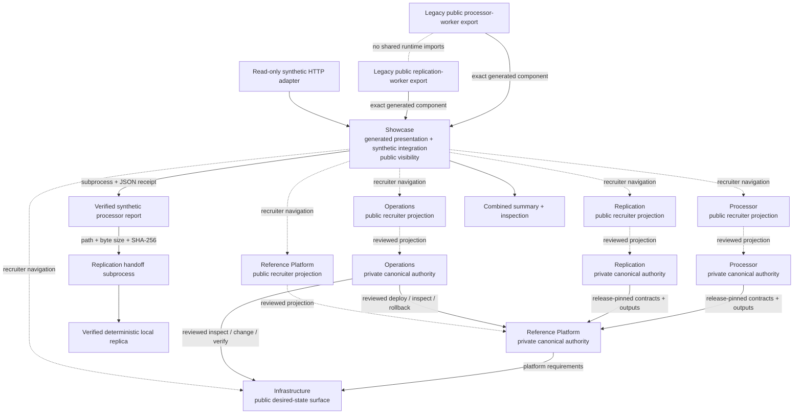

# Architecture walkthrough

The recruiter-facing hierarchy is **Reliable Engine (Processor + Replication)**,
**Reference Platform**, **Infrastructure**, **Operations**, and **Showcase**. Those labels
preserve the existing authority boundaries: component-product authority, application
composition, infrastructure desired state, operations execution/governance, and generated
presentation remain separate. This repository is the presentation layer, not a monorepo
copy of the other systems and not an implementation or execution authority for them.

## Canonical portfolio surfaces

The six canonical repository surfaces are Processor, Replication, Reference Platform,
Infrastructure, Operations, and Showcase. Canonical repository visibility is a publication
fact, not a readiness or authority judgement:

- Processor — `edge-evidence-processor`, private canonical authority;
- Replication — `edge-evidence-replication`, private canonical authority;
- Reference Platform — `edge-evidence-reference-platform`, private canonical authority;
- Infrastructure — [`edge-evidence-infrastructure`](https://github.com/Seemorghdev/edge-evidence-infrastructure), public direct technical surface;
- Operations — `edge-evidence-operations`, private canonical authority;
- Showcase — [`edge-evidence-showcase`](https://github.com/Seemorghdev/edge-evidence-showcase), public presentation surface.

Reviewed recruiter-facing projections expose selected public-safe engineering evidence
without changing canonical authority:

- [`edge-evidence-processor-public`](https://github.com/Seemorghdev/edge-evidence-processor-public)
- [`edge-evidence-replication-projection`](https://github.com/Seemorghdev/edge-evidence-replication-projection)
- [`edge-evidence-reference-platform-public`](https://github.com/Seemorghdev/edge-evidence-reference-platform-public)
- [`edge-evidence-operations-public`](https://github.com/Seemorghdev/edge-evidence-operations-public)

Public visibility does not mean a repository is complete, approved for production use, or
authorized to perform cloud changes. A public projection does not become implementation,
execution, or governance authority merely by being reviewable.

## Reliable Engine: Processor + Replication

Reliable Engine is the recruiter-facing name for the combined Processor + Replication
story; it is not a new repository or authority boundary. Processor owns deterministic
evidence processing, checkpoint/recovery, lineage verification, and replay-safe/idempotent
behavior. Replication owns immutable finalized-evidence replication, collision refusal,
independent readback verification, replay safety, and deterministic convergence. The
Reference Platform consumes their release-pinned contracts and deterministic outputs.

The current recruiter-facing Processor and Replication surfaces are the reviewed public
projections linked above. Their private canonical repositories remain implementation
authority.

The older public `edge-evidence-processor-worker` and
`edge-evidence-replication-worker` repositories remain **legacy generated/export
surfaces**. This showcase still bundles those exact generated worker products and installs
them into separate virtual environments for the runnable synthetic demonstration. Their
continued public existence does not redirect canonical component-product authority away
from `edge-evidence-processor` and `edge-evidence-replication`, and the copied
`components/` trees are not implementation authority.

The showcase process does not import worker runtime modules. It invokes the processor
through its Make/CLI surface, validates the processor receipt and report hash, then starts
a replication-environment subprocess that creates a fresh synthetic authority and runs
the replication CLI against those exact report bytes.

## Reference Platform, Infrastructure, and Operations

Public-safe recruiter summaries: [Reference Platform](REFERENCE-PLATFORM.md) and
[Operations Control Model](OPERATIONS-CONTROL-MODEL.md).

The Reference Platform is the separate application and cloud-integration surface. It
composes user-facing/application services around release-pinned processor/replication
contracts and deterministic outputs. Its canonical repository remains private, while the
reviewed [`edge-evidence-reference-platform-public`](https://github.com/Seemorghdev/edge-evidence-reference-platform-public)
projection is the recruiter-facing public surface.

Infrastructure and Operations are deliberately separate:

- **Infrastructure is desired state**: what reviewed cloud/platform state should exist.
  [`edge-evidence-infrastructure`](https://github.com/Seemorghdev/edge-evidence-infrastructure)
  is the direct public technical surface; public visibility is not a completeness claim
  and does not grant execution authority.
- **Operations is controlled execution and evidence governance**: how reviewed humans or
  automation may inspect or change state, verify outcomes, and follow rollback/evidence
  controls. Canonical Operations authority remains private; the reviewed
  [`edge-evidence-operations-public`](https://github.com/Seemorghdev/edge-evidence-operations-public)
  projection is recruiter-facing and does not become desired-state authority merely
  because it is public.

This distinction prevents Terraform/Kubernetes/platform desired state from being
conflated with the permissions, procedures, identities, and evidence required to inspect
or change that state.

## Showcase role

The Showcase provides recruiter/reviewer navigation, deterministic synthetic integration,
reproducibility guidance, and the public claim boundary. Its dotted recruiter-navigation
relationships in the diagram are descriptive only; they do not imply implementation,
deployment, infrastructure, operations, publication, or persistent-evidence authority.

The Showcase proves only the integrated synthetic path and presentation contracts. The
component SQLite databases and files remain separate. The combined summary and live HTTP
representation are verification/presentation surfaces, not new evidence authorities.

The HTTP adapter accepts no uploaded evidence, request body, query input, credentials, or
camera source. An instance executes the synthetic demonstration at most once, retains only
the public summary in process memory, and deletes temporary output.

That separation matters for public claims:

- local processor/replication reliability is demonstrated by the bundled generated worker
  exports;
- cross-process handoff is demonstrated here with synthetic inputs;
- Cloud Run and GKE facts come from separately accepted cloud evidence;
- private coordinates, retained evidence payloads, credentials, topology, and temporary
  endpoints are not copied into the public presentation.

Canonical private repositories remain intentionally separate from their public recruiter
projections. Publication of a projection does not transfer canonical authority.
