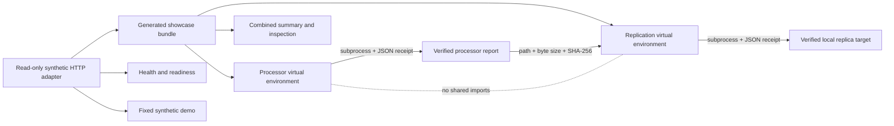

# Architecture

The two generated worker products remain independent packages and are installed into
separate virtual environments. The showcase process does not import worker runtime
modules. It invokes the processor product through its Make/CLI surface, validates the
processor receipt and report hash, then starts a replication-environment subprocess
that creates a fresh synthetic authority and runs the replication CLI against those
exact report bytes.

The HTTP adapter accepts no uploaded evidence, request body, query input, credentials,
or camera source. An instance executes the synthetic demonstration at most once,
retains only the public summary in process memory, and deletes the temporary output.
Cloud Run and Heroku use the same canonical runtime image.

The component SQLite databases and files remain separate. The combined summary and
live HTTP representation are presentation and verification surfaces, not new evidence
authorities.
