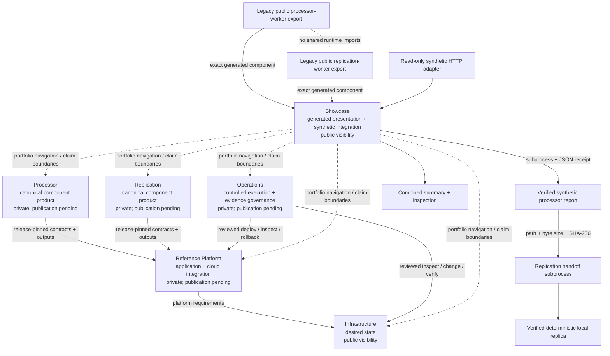

# Architecture walkthrough

The portfolio separates **component-product authority**, **application composition**,
**infrastructure desired state**, **operations execution/governance**, and **generated
presentation**. This repository is the presentation layer, not a monorepo copy of the
other systems and not an implementation or execution authority for them.

## Canonical portfolio surfaces

The six canonical repository surfaces are Processor, Replication, Reference Platform,
Infrastructure, Operations, and Showcase. Their current repository visibility is a
publication fact, not a readiness or authority judgement:

- Processor — `edge-evidence-processor`, currently private;
- Replication — `edge-evidence-replication`, currently private;
- Reference Platform — `edge-evidence-reference-platform`, currently private;
- Infrastructure — `edge-evidence-infrastructure`, currently public;
- Operations — `edge-evidence-operations`, currently private;
- Showcase — `edge-evidence-showcase`, currently public.

Private surfaces are named without fabricating public links. Public visibility does not
mean a repository is complete, approved for production use, or authorized to perform cloud changes.

## Processor, replication, and legacy worker exports

Processor owns deterministic evidence-processing behavior and contracts. Replication owns
immutable finalized-evidence replication, independent readback verification, collision
refusal, and replication contracts. The Reference Platform consumes their release-pinned
contracts and deterministic outputs.

The older public `edge-evidence-processor-worker` and
`edge-evidence-replication-worker` repositories remain **legacy generated/export
surfaces**. This showcase still bundles those exact generated worker products and installs
them into separate virtual environments for the runnable synthetic demonstration. Their
continued public existence does not redirect canonical component-product authority away
from `edge-evidence-processor` and `edge-evidence-replication`, and the copied
`components/` trees are not implementation authority.

The showcase process does not import worker runtime modules. It invokes the processor
through its Make/CLI surface, validates the processor receipt and report hash, then starts
a replication-environment subprocess that creates a fresh synthetic authority and runs
the replication CLI against those exact report bytes.

## Reference Platform, Infrastructure, and Operations

The Reference Platform is the separate application and cloud-integration surface. It
composes user-facing/application services around release-pinned processor/replication
contracts and deterministic outputs.

Infrastructure and Operations are deliberately separate:

- **Infrastructure is desired state**: what reviewed cloud/platform state should exist.
  Its current public visibility is not a completeness claim and does not grant execution
  authority.
- **Operations is controlled execution and evidence governance**: how reviewed humans or
  automation may inspect or change state, verify outcomes, and follow rollback/evidence
  controls. It does not become desired-state authority merely because it may apply or
  inspect Infrastructure.

This distinction prevents Terraform/Kubernetes/platform desired state from being
conflated with the permissions, procedures, identities, and evidence required to inspect
or change that state.

## Showcase role

The Showcase provides recruiter/reviewer navigation, deterministic synthetic integration,
reproducibility guidance, and the public claim boundary. Its dotted portfolio-navigation
relationships in the diagram are descriptive only; they do not imply implementation,
deployment, infrastructure, operations, publication, or persistent-evidence authority.

The Showcase proves only the integrated synthetic path and presentation contracts. The
component SQLite databases and files remain separate. The combined summary and live HTTP
representation are verification/presentation surfaces, not new evidence authorities.

The HTTP adapter accepts no uploaded evidence, request body, query input, credentials, or
camera source. An instance executes the synthetic demonstration at most once, retains only
the public summary in process memory, and deletes temporary output.

That separation matters for public claims:

- local processor/replication reliability is demonstrated by the bundled generated worker
  exports;
- cross-process handoff is demonstrated here with synthetic inputs;
- Cloud Run and GKE facts come from separately accepted cloud evidence;
- private coordinates, retained evidence payloads, credentials, topology, and temporary
  endpoints are not copied into the public presentation.

Canonical private repositories are intentionally named without public technical links.
Their future publication is a separate release decision.
