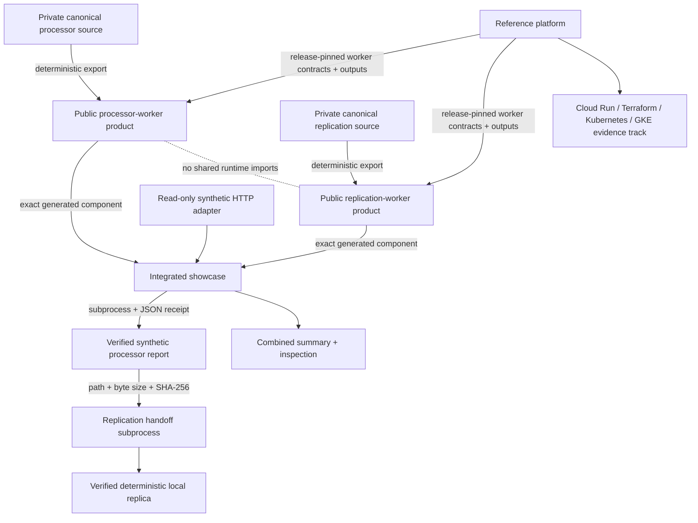

# Architecture walkthrough

The portfolio deliberately separates **worker authority**, **synthetic presentation**, and
**cloud integration**. This repository is the presentation layer, not a monorepo copy of
the other systems.

## Processor and replication

The two public worker repositories are independent **generated products**. Their
canonical implementation sources remain private and upstream-first. The showcase bundles
the generated worker products and installs them into separate virtual environments; it
does not make the copied `components/` trees authoritative.

The showcase process does not import worker runtime modules. It invokes the processor
through its Make/CLI surface, validates the processor receipt and report hash, then starts
a replication-environment subprocess that creates a fresh synthetic authority and runs
the replication CLI against those exact report bytes.

## Showcase role

The showcase proves only the integrated synthetic path and presentation contracts. The
component SQLite databases and files remain separate. The combined summary and live HTTP
representation are verification/presentation surfaces, not new evidence authorities.

The HTTP adapter accepts no uploaded evidence, request body, query input, credentials, or
camera source. An instance executes the synthetic demonstration at most once, retains only
the public summary in process memory, and deletes temporary output.

## Reference-platform role

The reference platform is a separate end-to-end application and cloud-integration track.
It consumes release-pinned processor/replication contracts and deterministic outputs; it
is not generated from this showcase and this showcase is not its deployment authority.

That separation matters for public claims:

- local processor/replication reliability is demonstrated by the generated worker products;
- cross-process handoff is demonstrated here with synthetic inputs;
- Cloud Run and GKE facts come from separately accepted cloud evidence;
- private coordinates, retained evidence payloads, credentials, topology, and temporary
  endpoints are not copied into the public presentation.

The reference-platform repository is currently private, so a public technical link is
intentionally not fabricated. Public publication of that repository is a separate release
decision.
